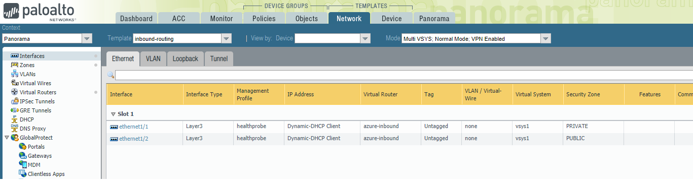
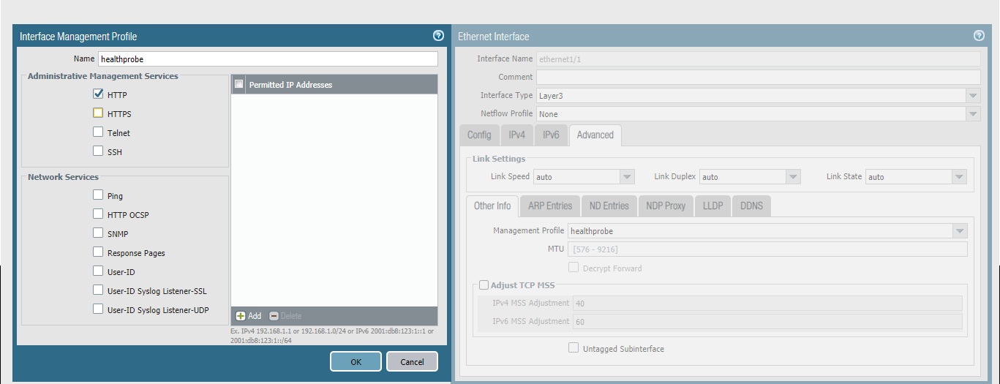

# Panorama Configuration

After running **terraform apply**, an instance of Panorama will be created and the Public IP address output on the command line

```
Apply complete! Resources: 2 added, 0 changed, 2 destroyed.

Outputs:

PANORAMA-IP = 20.37.44.190
```

This is an unconfigured instance of panorama, and you still need to perform the following tasks manually:

1. License Panorama 
2. Create the device group and template-stacks
3. Add the networking config manually


The following sections walk through each step in detail. 

**This guide assumes you have basic Palo Alto NGFW experience and only covers the azure-specific config that is required.**

## License Panorama


Login to the public IP of the panorama instance using https://[PANORAMA-IP] and the username/password you specified in
variables.

Immediately you will be presented by the popup warning you that Panorama is Unlicensed. Navigate to Panorama->setup and 
in the *General Settings* section, set the serial number associated with your Panorama license in the support portal.

From Panorama->Licenses, click *retrieve licenses from license server* to license panorama.

## Configure Device Groups and Template Stack


This terraform template automatically bootstraps the firewalls such that they are automatically connected into the following
device-groups and template stacks;
* INBOUND 
* OUTBOUND

You must configure Panorama with these exact names before the firewalls are configurable. As soon as they are configured
and committed, the firewalls will appear.

You should also add two new templates (at least) and add them to their parent template-stacks;

* inbound-template
* outbound-template

These templates will contain all the networking and other device related configuration.

## Add networking config 


**There is currently a big with the Azure Terraform provider that randomizes the NIC config for the Scale Sets.**

**When you deploy, you need to login to one (it can be any) of the running instances in the scale set and check which interface
is attached to the public network, and which is attached to the private network. You can do this by looking at the Runtime
DHCP Information under Network->Interfaces**

Under each template, configure the network interfaces ethernet1/1 and ethernet1/2 as Layer3 interfaces,
ensuring the IPv4 Type is set to DHCP and a management config is attached that permits HTTP for the Azure Load Balancer traffic.



Add a virtual router for each template. Configure the following routes in the outbound template;

| Destination     | Next Hop     | Description     |
| :------------- | :----------: | -----------: |
|  0.0.0.0/0 | 10.110.129.1   | Default route out the public interface   |
|  10.0.0.0/8| 10.110.0.1   |   Route to the Azure internal networks   |
|  168.63.129.16/32 | 10.110.0.1   |   LB health probe IP address on PRIVATE interface  |
 
 Configure the following routes in the inbound template;
 
 | Destination     | Next Hop     | Description     |
| :------------- | :----------: | -----------: |
|  0.0.0.0/0 | 10.110.129.1   | Default route out the public interface   |
|  10.0.0.0/8| 10.110.0.1   |   Route to the Azure internal networks   |
|  168.63.129.16/32 | 10.110.129.1   |   LB health probe IP address on PUBLIC interface  |
 
 Note the only difference between these two virtual router configs is the interface the firewall uses to respond to
 health probes.
 
 ## Next Steps
 
The Firewalls are now configured to route traffic. You can now proceed to creating the security and NAT policy, 
which is out of scope for this documentation.