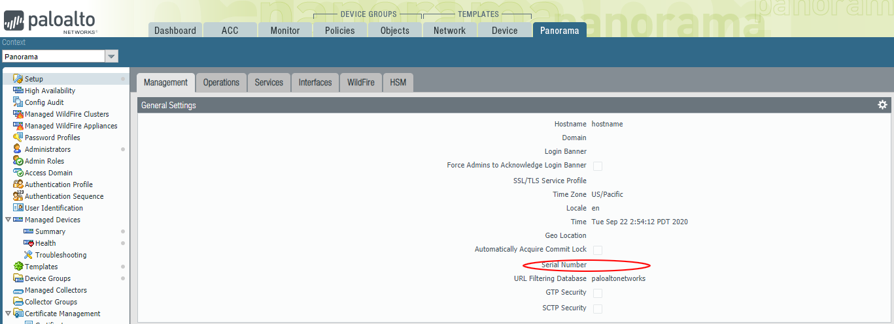

# Panorama Configuration

After running **terraform apply**, an instance of Panorama will be created and the Public IP address output on the command line

```
Apply complete! Resources: 2 added, 0 changed, 2 destroyed.

Outputs:

PANORAMA-IP = 20.37.44.190
```

This is an unconfigured instance of panorama, and you still need to perform the following tasks manually:

1. License Panorama 
2. Create the device group and template-stacks
3. Add the networking config manually
4. Add the outbound NAT and security policy
5. (Optional) Add any Inbound NAT and security policies.

The following sections walk through each step in detail.

## License Panorama


Login to the public IP of the panorama instance using https://[PANORAMA-IP] and the username/password you specified in
variables.

Immediately you will be presented by the popup warning you that Panorama is Unlicensed. Navigate to Panorama->setup and 
in the *General Settings* section, set the serial number associated with your Panorama license in the support portal.

From Panorama->Licenses, click *retrieve licenses from license server* to license panorama.

## Configure Device Groups and Template Stack


This terraform template automatically bootstraps the firewalls such that they are automatically connected into the following
device-groups and template stacks;
* INBOUND 
* OUTBOUND

You must configure Panorama with these exact names before the firewalls are configurable. As soon as they are configured
and committed, the firewalls will appear.

