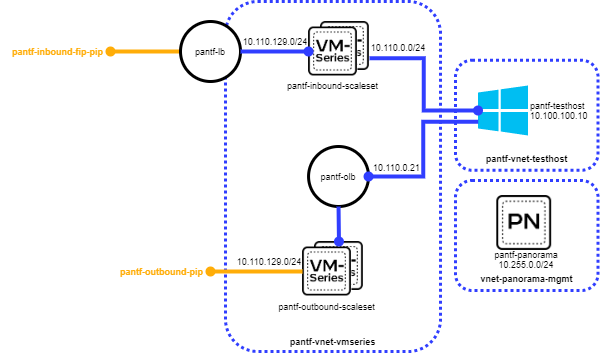

# Azure Topology

## Reference Architecture
The reference architecture this deployment is based on [is published on the palo alto networks website.](https://www.paloaltonetworks.com/resources/guides/azure-architecture-guide)

There is only one major difference, and that is that Scale Sets are used instead of individual VMs, as it simplifies
the terraform deployment and makes it easier to scale out depending on requirements.

## Topology Description
The Network topology this terraform config deploys is a *transit-vnet* design, with a split of Inbound and Outbound
VM series, configured in scale-sets for simplicity, scale, and redundancy. 

An *Inbound* Load Balancer directs traffic to the inbound scale set **public** interfaces, which then SNATs the traffic
to the interface address of the **private** interface, and DNATs to the address of the actual backend server (or second load balancer/appgw)

A UDR on in the Spoke VNETs directs all outgoing traffic to the Outbound load balancer, which is configured with the 
outbound scale set in a HA port backend pool, ensuring all traffic is routed through the firewalls before leaving Azure.